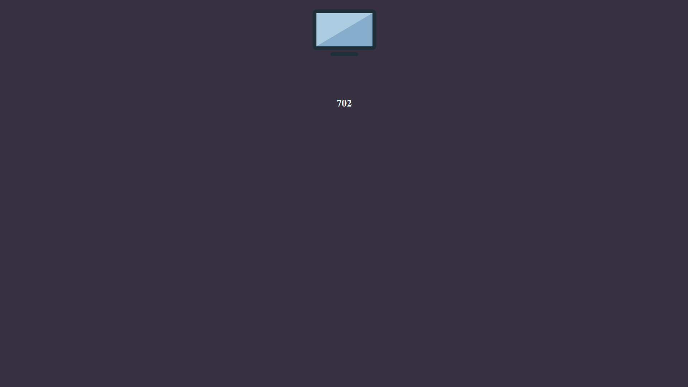
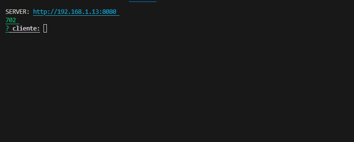
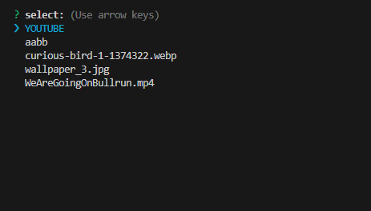

# Screenland

Reproducao remota administrado via CLI e front no browser. 

## Usage

`$ npm install ` 

`$ npm run server` 

> Arquivos devem estar na pasta ./public/ext/

> Escolhar um cliente ativo  e selecione  para rodar em loop
> * arquivo video ou imagem em formato popular jpg,png,webp .
> * pasta com varios videos.
> * video do youtube.

> Painel
[http://localhost:8080](http://localhost:8080)
## Screenshorts

> Client \

> Admin \

